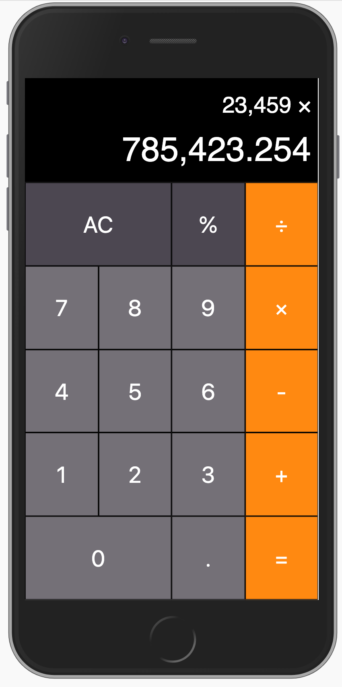
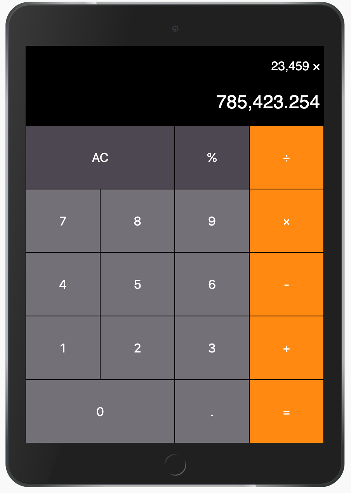
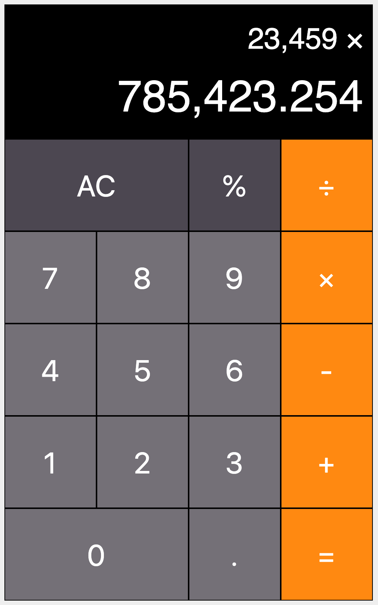

# How to set up the iOS Calculator on your computer:
1. Download the repository's ZIP file and unzip it.
2. Go inside the 'public' folder and open 'index.html' with your browser.

# iOS Calculator App
The App has been developed using responsive layouts in order to fit various devices.

## iPhone 6 / 7 / 8:

## iPad:

## Desktop:

